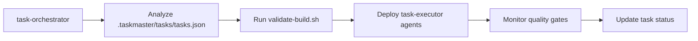
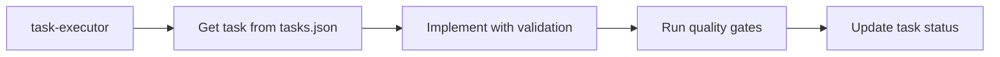
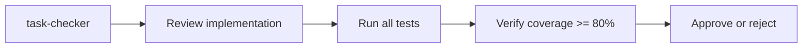

# Claude Agents - Ergoplanner AI Suite

## Overview

All agents are integrated with Task Master and enforce **STRICT QUALITY GATES** with zero tolerance for errors or warnings.

## ⚠️ CRITICAL: Quality Enforcement

**NO agent can complete work if:**
- ❌ Build errors exist
- ❌ Build warnings exist
- ❌ Tests are failing
- ❌ Code coverage < 80%
- ❌ Linting errors present

## Agent Directory

### Task Management Agents

| Agent | Purpose | Task Master Integration | Quality Gates |
|-------|---------|------------------------|---------------|
| **task-orchestrator** | Coordinates task execution and parallelization | ✅ Full - Uses `.taskmaster/tasks/tasks.json` | ✅ Enforces validation before/after tasks |
| **task-executor** | Implements specific tasks | ✅ Full - Updates task status and notes | ✅ Continuous validation during work |
| **task-checker** | Verifies task completion | ✅ Full - Validates against requirements | ✅ Quality verification before approval |

### Development Agents

| Agent | Purpose | Task Master Integration | Quality Gates |
|-------|---------|------------------------|---------------|
| **ergoplanner-backend-developer** | .NET Core backend implementation | ✅ Reads task requirements | ✅ Zero warnings, 80% coverage |
| **frontend-react-engineer** | React/Next.js frontend development | ✅ Updates task progress | ✅ TypeScript strict, Jest tests |
| **ml-pid-engineer** | ML.NET services for P&ID | ✅ Task-aware implementation | ✅ Model validation, tests |
| **database-devops-architect** | Database design & DevOps | ✅ Infrastructure tasks | ✅ Migration testing, CI/CD |

### Quality & Process Agents

| Agent | Purpose | Task Master Integration | Quality Gates |
|-------|---------|------------------------|---------------|
| **qa-testing-engineer** | Testing strategy & implementation | ✅ Test requirements from tasks | ✅ Coverage enforcement |
| **security-compliance-engineer** | Security & compliance | ✅ Security task handling | ✅ Vulnerability scanning |
| **agile-project-manager** | Sprint & project management | ✅ Full task oversight | ✅ Velocity & quality metrics |
| **technical-docs-writer** | Documentation creation | ✅ Documentation tasks | ✅ Doc validation |

### Design Agents

| Agent | Purpose | Task Master Integration | Quality Gates |
|-------|---------|------------------------|---------------|
| **system-architect-ergoplanner** | System architecture decisions | ✅ Architecture tasks | ✅ Design validation |
| **ux-ui-designer** | UI/UX design | ✅ Design tasks | ✅ Accessibility checks |

## Task Master File Locations

All agents reference these standard locations:

```yaml
task_files:
  tasks: .taskmaster/tasks/tasks.json
  config: .taskmaster/config.json
  state: .taskmaster/state.json
  guide: .taskmaster/CLAUDE.md

project_files:
  standards: CLAUDE.md
  validation: scripts/validate-build.sh
  quality: scripts/run-quality-gates.sh
  pre_commit: scripts/pre-commit-check.sh
```

## Quality Gate Scripts

All agents must use these validation scripts:

### Primary Validation
```bash
# Before starting ANY work
./scripts/validate-build.sh

# After completing ANY task
./scripts/run-quality-gates.sh

# Before ANY commit
./scripts/pre-commit-check.sh
```

### Continuous Validation
```bash
# Backend checks
dotnet build --no-incremental /warnaserror
dotnet test --collect:"XPlat Code Coverage"

# Frontend checks
npm run build
npm run lint -- --max-warnings 0
npm test -- --coverage --watchAll=false

# TypeScript
npx tsc --noEmit --strict
```

## Agent Workflow Integration

### 1. Task Orchestration Flow


### 2. Task Execution Flow


### 3. Task Verification Flow


## Task Master Commands Used by Agents

```bash
# Task retrieval
task-master list                    # Get all tasks
task-master show <id>              # Get task details
task-master next                   # Get next priority task

# Status updates
task-master set-status --id=<id> --status=<status>
# Status values: pending, in-progress, review, blocked, done

# Progress tracking
task-master update-task --id=<id> --prompt="notes"
task-master update-subtask --id=<id> --prompt="progress"

# Validation
task-master validate-dependencies
```

## Quality Enforcement Rules

### Blocking Conditions
Agents MUST STOP work when:
- 🚨 Build error detected
- 🚨 Build warning present
- 🚨 Test failure
- 🚨 Coverage < 80%
- 🚨 Linting error
- 🚨 Security vulnerability

### Task Completion Requirements
Agents can ONLY mark tasks complete when:
- ✅ Zero build errors
- ✅ Zero build warnings
- ✅ 100% tests passing
- ✅ >= 80% code coverage
- ✅ Zero linting issues
- ✅ Documentation updated
- ✅ Quality gates passed

## Agent Communication Protocol

### Task Assignment Format
```yaml
task_assignment:
  task_id: [from tasks.json]
  objective: [clear goal]
  requirements:
    - quality_gates: ./scripts/validate-build.sh
    - coverage_minimum: 80%
    - zero_warnings: true
  validation:
    - pre_work: validate-build.sh
    - during_work: continuous
    - post_work: run-quality-gates.sh
```

### Progress Reporting Format
```yaml
progress_report:
  task_id: [id]
  status: [in-progress|blocked|review|done]
  quality_metrics:
    build: [pass|fail]
    tests: [pass|fail]
    coverage: [percentage]
    warnings: [count - must be 0]
  issues: [any blockers]
  next_steps: [planned actions]
```

## Enhanced Agents

For agents with enhanced quality enforcement, use these versions:
- `task-orchestrator-enhanced.md` - Orchestrator with zero-tolerance
- `task-executor-enhanced.md` - Executor with strict validation

## ⛔ Forbidden Practices

Agents MUST NEVER:
- ❌ Skip validation to save time
- ❌ Commit with warnings
- ❌ Mark tasks done with failures
- ❌ Lower quality thresholds
- ❌ Use `--no-verify` flags
- ❌ Suppress or ignore errors
- ❌ Comment out failing tests

## Success Metrics

Agent performance measured by:
1. Task completion rate with quality
2. Zero defect rate
3. Coverage maintenance (>= 80%)
4. Build success rate (must be 100%)
5. Time to quality gate passage

## Quick Reference

### Check Everything
```bash
./scripts/run-quality-gates.sh
```

### Task Workflow
```bash
# Get task
task-master show <id>

# Start work (only if clean)
./scripts/validate-build.sh
task-master set-status --id=<id> --status=in-progress

# Complete (only if quality passes)
./scripts/run-quality-gates.sh
task-master set-status --id=<id> --status=done
```

**Remember: Quality is NON-NEGOTIABLE across all agents!**