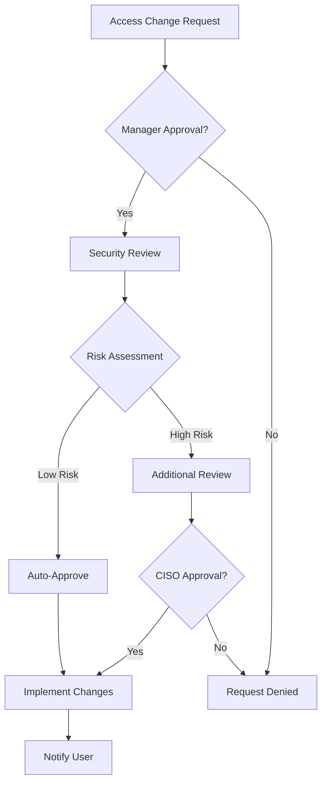
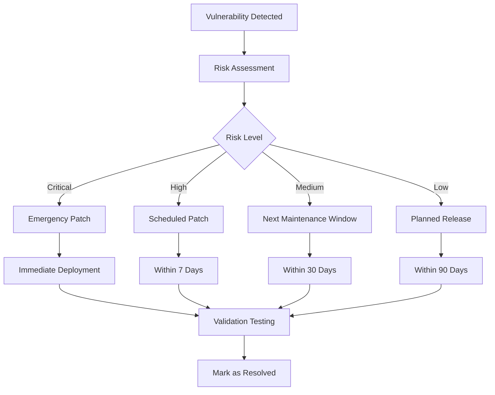
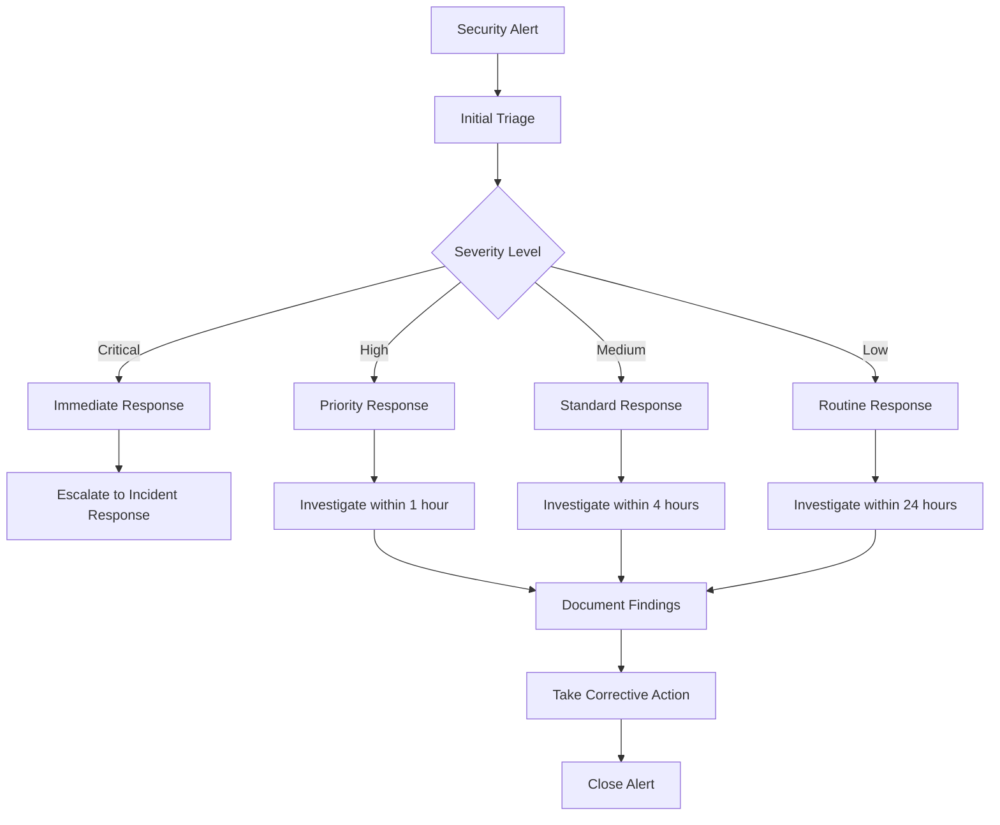

# Security Procedures and Policies

## Overview

This document outlines the security procedures, policies, and operational guidelines for the Ergoplanner AI Suite. These procedures ensure consistent application of security controls and provide clear guidance for security incident response.

## Table of Contents

1. [Security Governance](#security-governance)
2. [Access Control Procedures](#access-control-procedures)
3. [Incident Response Procedures](#incident-response-procedures)
4. [Vulnerability Management](#vulnerability-management)
5. [Secure Development Procedures](#secure-development-procedures)
6. [Data Protection Procedures](#data-protection-procedures)
7. [Compliance and Audit Procedures](#compliance-and-audit-procedures)
8. [Security Monitoring Procedures](#security-monitoring-procedures)

## Security Governance

### Security Organization Structure

```
Chief Security Officer (CSO)
├── Security Architecture Team
├── Security Operations Team
├── Compliance Team
└── Incident Response Team
```

### Roles and Responsibilities

#### Security Administrator
- **Primary Responsibilities:**
  - Manage security infrastructure
  - Configure security controls
  - Monitor security events
  - Coordinate incident response

#### Security Architect
- **Primary Responsibilities:**
  - Design security architecture
  - Review security requirements
  - Conduct threat modeling
  - Define security standards

#### Security Analyst
- **Primary Responsibilities:**
  - Monitor security logs
  - Investigate security incidents
  - Perform vulnerability assessments
  - Generate security reports

#### Development Security Champion
- **Primary Responsibilities:**
  - Implement secure coding practices
  - Conduct security code reviews
  - Coordinate security testing
  - Provide security training

### Security Policy Framework

#### Information Security Policy
- **Purpose:** Establish overarching security principles
- **Scope:** All systems, users, and data
- **Review Frequency:** Annually

#### Access Control Policy
- **Purpose:** Define access control requirements
- **Scope:** All user accounts and system access
- **Review Frequency:** Bi-annually

#### Data Protection Policy
- **Purpose:** Protect sensitive data throughout its lifecycle
- **Scope:** All data processing activities
- **Review Frequency:** Annually

## Access Control Procedures

### User Account Management

#### Account Provisioning Process

1. **Request Initiation**
   - Submit access request through approved channels
   - Include business justification
   - Specify required access level

2. **Authorization**
   - Manager approval required
   - Security team review for privileged access
   - Document approval trail

3. **Account Creation**
   - Create account with least privilege
   - Assign appropriate role-based permissions
   - Configure multi-factor authentication

4. **Account Activation**
   - Send account credentials securely
   - Require password change on first login
   - Provide security awareness training

#### Account Modification Process



#### Account Deprovisioning Process

1. **Triggering Events**
   - Employee termination
   - Role change
   - Extended leave
   - Contract expiration

2. **Immediate Actions (within 2 hours)**
   - Disable primary accounts
   - Revoke system access
   - Collect company devices
   - Notify security team

3. **Follow-up Actions (within 24 hours)**
   - Remove from all groups and roles
   - Delete or archive mailbox
   - Transfer data ownership
   - Update documentation

### Privileged Access Management

#### Administrative Account Standards

- **Separate Administrative Accounts**
  - No shared administrative accounts
  - Dedicated admin accounts for privileged tasks
  - Regular user accounts for daily activities

- **Just-in-Time Access**
  - Time-limited privileged access
  - Business justification required
  - Automatic access revocation

- **Privileged Session Monitoring**
  - All privileged sessions recorded
  - Real-time monitoring and alerting
  - Regular access reviews

#### Service Account Management

```yaml
Service Account Policy:
  - Unique service accounts per application
  - Strong, randomly generated passwords
  - Automatic password rotation (90 days)
  - Minimal required permissions
  - Regular access reviews
  - Documentation of service account purpose
```

## Incident Response Procedures

### Incident Classification

#### Severity Levels

| Level | Description | Response Time | Examples |
|-------|-------------|---------------|----------|
| **Critical** | Immediate threat to business operations | 1 hour | Data breach, system compromise |
| **High** | Significant security impact | 4 hours | Malware infection, unauthorized access |
| **Medium** | Moderate security impact | 24 hours | Security policy violation, suspicious activity |
| **Low** | Minor security concern | 72 hours | Failed login attempts, policy questions |

### Incident Response Process

#### Phase 1: Preparation
- **Team Readiness**
  - Incident response team identified and trained
  - Contact information current and accessible
  - Response procedures documented and tested
  - Tools and resources available

- **Communication Plan**
  - Internal escalation procedures
  - External communication protocols
  - Media response guidelines
  - Customer notification procedures

#### Phase 2: Identification
- **Detection Sources**
  - Security monitoring systems
  - User reports
  - Third-party notifications
  - Automated alerts

- **Initial Assessment**
  - Verify incident authenticity
  - Determine scope and impact
  - Classify incident severity
  - Activate response team

#### Phase 3: Containment
- **Short-term Containment**
  - Isolate affected systems
  - Prevent spread of compromise
  - Preserve evidence
  - Maintain business operations

- **Long-term Containment**
  - Apply temporary fixes
  - Implement additional monitoring
  - Prepare for recovery phase
  - Update stakeholders

#### Phase 4: Eradication
- **Root Cause Analysis**
  - Identify attack vectors
  - Determine extent of compromise
  - Analyze attacker methods
  - Document findings

- **Threat Removal**
  - Remove malware and backdoors
  - Close security vulnerabilities
  - Strengthen security controls
  - Validate remediation

#### Phase 5: Recovery
- **System Restoration**
  - Restore from clean backups
  - Rebuild compromised systems
  - Implement additional security measures
  - Monitor for recurring issues

- **Business Operations**
  - Resume normal operations
  - Validate system functionality
  - Monitor system performance
  - Update stakeholders

#### Phase 6: Lessons Learned
- **Post-Incident Review**
  - Conduct incident debriefing
  - Document lessons learned
  - Update procedures and policies
  - Provide additional training

### Incident Communication Templates

#### Internal Notification Template

```
Subject: [URGENT] Security Incident Alert - [Incident ID]

SECURITY INCIDENT NOTIFICATION

Incident ID: [ID]
Severity: [Critical/High/Medium/Low]
Detected: [Date/Time]
Reporter: [Name/System]

Initial Assessment:
- Affected Systems: [List]
- Potential Impact: [Description]
- Current Status: [Status]

Immediate Actions:
- [Action 1]
- [Action 2]
- [Action 3]

Next Update: [Time]

Contact: [Incident Commander]
```

#### Customer Notification Template

```
Subject: Important Security Update - Ergoplanner AI Suite

Dear Valued Customer,

We are writing to inform you of a security incident that may have affected
your account. We take the security of your data very seriously and want to
provide you with full transparency about this situation.

What Happened:
[Brief, clear description of the incident]

What Information Was Involved:
[Specific data types that were potentially affected]

What We Are Doing:
[Steps taken to address the issue]

What You Can Do:
[Specific actions customers should take]

How to Contact Us:
[Contact information for questions]

We sincerely apologize for any inconvenience this may cause and appreciate
your continued trust in our services.

Sincerely,
Ergoplanner Security Team
```

## Vulnerability Management

### Vulnerability Assessment Schedule

| Assessment Type | Frequency | Scope | Responsibility |
|----------------|-----------|-------|----------------|
| **Automated Scanning** | Weekly | All systems | Security Operations |
| **Manual Penetration Testing** | Quarterly | Critical systems | External vendor |
| **Code Security Review** | Per release | All code changes | Development team |
| **Infrastructure Assessment** | Monthly | Network and servers | Infrastructure team |

### Vulnerability Handling Process

#### Discovery and Assessment
1. **Identification Sources**
   - Automated vulnerability scanners
   - Security researchers
   - Vendor security advisories
   - Penetration testing results

2. **Risk Assessment**
   - Evaluate CVSS score
   - Assess business impact
   - Determine exploitability
   - Consider environmental factors

3. **Prioritization Matrix**

| CVSS Score | Business Impact | Priority | SLA |
|------------|----------------|----------|-----|
| 9.0-10.0 | High | Critical | 72 hours |
| 7.0-8.9 | High | High | 7 days |
| 4.0-6.9 | Medium | Medium | 30 days |
| 0.1-3.9 | Low | Low | 90 days |

#### Remediation Process



## Secure Development Procedures

### Secure Development Lifecycle (SDL)

#### Requirements Phase
- **Security Requirements Definition**
  - Identify security requirements
  - Define threat model
  - Specify compliance requirements
  - Document security acceptance criteria

#### Design Phase
- **Security Architecture Review**
  - Conduct threat modeling
  - Review security controls
  - Validate security architecture
  - Document security design decisions

#### Implementation Phase
- **Secure Coding Practices**
  - Follow secure coding guidelines
  - Use security code analysis tools
  - Implement input validation
  - Apply defense-in-depth principles

- **Security Code Review Process**
  ```
  1. Automated Security Scanning
     - SAST (Static Application Security Testing)
     - Dependency vulnerability scanning
     - Secret detection

  2. Manual Security Review
     - Authentication/authorization logic
     - Input validation implementation
     - Cryptographic implementation
     - Error handling

  3. Peer Review Requirements
     - All security-related code changes
     - Two reviewer approval required
     - Security champion involvement
  ```

#### Testing Phase
- **Security Testing Requirements**
  - Unit tests for security functions
  - Integration tests for security controls
  - Penetration testing for critical features
  - Compliance validation testing

#### Deployment Phase
- **Secure Deployment Checklist**
  - [ ] Security configuration verified
  - [ ] Credentials securely managed
  - [ ] Security monitoring enabled
  - [ ] Backup and recovery tested
  - [ ] Incident response plan updated

#### Maintenance Phase
- **Ongoing Security Activities**
  - Regular security updates
  - Vulnerability monitoring
  - Security metrics collection
  - Continuous security improvement

### Code Security Standards

#### Input Validation Standards
```csharp
// Required input validation pattern
public class InputValidator
{
    public static bool ValidateInput(string input, InputType type)
    {
        // 1. Null/empty check
        if (string.IsNullOrWhiteSpace(input))
            return false;

        // 2. Length validation
        if (input.Length > GetMaxLength(type))
            return false;

        // 3. Pattern validation
        if (!Regex.IsMatch(input, GetValidationPattern(type)))
            return false;

        // 4. Injection prevention
        if (ContainsMaliciousPatterns(input))
            return false;

        return true;
    }
}
```

#### Authentication Implementation Standards
```csharp
// Required authentication pattern
[Authorize(Roles = "Administrator,Manager")]
public async Task<IActionResult> SensitiveOperation()
{
    // 1. Verify user identity
    var userId = User.FindFirst(ClaimTypes.NameIdentifier)?.Value;
    if (string.IsNullOrEmpty(userId))
        return Unauthorized();

    // 2. Additional authorization check
    if (!await HasPermission(userId, "SensitiveOperation"))
        return Forbid();

    // 3. Log security event
    _logger.LogInformation("User {UserId} performed sensitive operation", userId);

    // 4. Proceed with operation
    return Ok();
}
```

## Data Protection Procedures

### Data Classification

#### Classification Levels

| Level | Description | Examples | Protection Requirements |
|-------|-------------|----------|------------------------|
| **Public** | Information intended for public disclosure | Marketing materials, published documentation | Standard backup and integrity |
| **Internal** | Information for internal use only | Internal procedures, employee directories | Access controls, encryption in transit |
| **Confidential** | Sensitive business information | Customer data, financial information | Strong access controls, encryption at rest and in transit |
| **Restricted** | Highly sensitive information | Personal data, trade secrets | Strongest protections, audit logging, DLP |

### Data Handling Procedures

#### Data Collection
- **Minimal Data Collection**
  - Collect only necessary data
  - Document data collection purpose
  - Obtain appropriate consent
  - Implement retention limits

#### Data Processing
- **Processing Principles**
  - Process data only for stated purposes
  - Implement data minimization
  - Ensure processing is lawful
  - Maintain processing records

#### Data Storage
- **Storage Requirements**
  - Encrypt sensitive data at rest
  - Implement access controls
  - Use approved storage locations
  - Regular backup and testing

#### Data Transmission
- **Transmission Security**
  - Encrypt data in transit (TLS 1.3+)
  - Use secure file transfer protocols
  - Verify recipient authorization
  - Log transmission activities

#### Data Retention and Disposal
```yaml
Retention Schedule:
  Customer Data:
    Personal Information: 7 years after account closure
    Transaction Records: 10 years
    Support Tickets: 3 years

  System Data:
    Security Logs: 2 years
    Application Logs: 1 year
    Performance Metrics: 6 months

  Development Data:
    Source Code: Indefinite
    Test Data: 90 days after release
    Development Logs: 30 days

Disposal Methods:
  - Electronic Media: DoD 5220.22-M (3-pass overwrite)
  - Paper Documents: Cross-cut shredding
  - Cloud Storage: Cryptographic erasure
  - Database Records: Secure deletion with verification
```

### Privacy Protection Procedures

#### GDPR Compliance
- **Data Subject Rights**
  - Right to access
  - Right to rectification
  - Right to erasure
  - Right to portability
  - Right to object

- **Privacy by Design**
  - Privacy considerations in system design
  - Data protection impact assessments
  - Privacy-preserving technologies
  - Regular privacy reviews

#### Data Breach Response
1. **Detection and Assessment** (within 72 hours)
   - Identify scope of breach
   - Assess risk to individuals
   - Document incident details
   - Notify relevant authorities

2. **Notification Requirements**
   - Supervisory authority (within 72 hours)
   - Affected individuals (without undue delay)
   - Business partners (as contractually required)
   - Insurance providers

## Compliance and Audit Procedures

### Compliance Framework

#### Regulatory Compliance
- **ISO 27001** - Information Security Management
- **SOC 2** - Service Organization Controls
- **GDPR** - General Data Protection Regulation
- **NIST Cybersecurity Framework** - Risk Management

#### Compliance Monitoring
```yaml
Compliance Activities:
  Daily:
    - Security event monitoring
    - Access control validation
    - Data backup verification

  Weekly:
    - Vulnerability scanning
    - Security metrics review
    - Compliance dashboard update

  Monthly:
    - Security control testing
    - Risk assessment review
    - Compliance gap analysis

  Quarterly:
    - External security assessment
    - Compliance audit preparation
    - Policy and procedure review

  Annually:
    - Comprehensive security audit
    - Certification renewal
    - Compliance framework update
```

### Audit Procedures

#### Internal Audit Process
1. **Audit Planning**
   - Define audit scope and objectives
   - Select audit team
   - Schedule audit activities
   - Prepare audit checklist

2. **Audit Execution**
   - Conduct interviews
   - Review documentation
   - Test security controls
   - Document findings

3. **Audit Reporting**
   - Prepare audit report
   - Identify non-compliance issues
   - Recommend corrective actions
   - Present to management

4. **Follow-up**
   - Track remediation progress
   - Verify corrective actions
   - Update compliance status
   - Schedule follow-up audits

#### External Audit Support
- **Auditor Coordination**
  - Assign audit liaison
  - Provide requested documentation
  - Schedule interviews and testing
  - Address auditor questions

- **Evidence Management**
  - Maintain compliance documentation
  - Organize evidence repository
  - Ensure document integrity
  - Provide timely access

## Security Monitoring Procedures

### Security Operations Center (SOC)

#### 24/7 Monitoring Coverage
- **Primary Monitoring**
  - Security information and event management (SIEM)
  - Network intrusion detection
  - Endpoint detection and response
  - Application security monitoring

- **Secondary Monitoring**
  - Threat intelligence feeds
  - Vulnerability management
  - Compliance monitoring
  - Business continuity monitoring

#### Alert Response Procedures



### Security Metrics and KPIs

#### Security Performance Indicators
- **Mean Time to Detection (MTTD)**
- **Mean Time to Response (MTTR)**
- **Number of security incidents per month**
- **Percentage of systems patched within SLA**
- **Security training completion rate**
- **Compliance assessment scores**

#### Security Dashboard
```yaml
Real-time Metrics:
  - Active security alerts
  - System availability status
  - Network traffic anomalies
  - Failed authentication attempts

Daily Metrics:
  - Security incidents closed
  - Vulnerability remediation progress
  - Backup success rate
  - Compliance score

Weekly Metrics:
  - Security training completion
  - Risk assessment updates
  - Policy exceptions approved
  - Third-party security reviews

Monthly Metrics:
  - Overall security posture score
  - Incident trend analysis
  - Compliance gap analysis
  - Security investment ROI
```

## Contact Information

### Security Team Contacts

| Role | Contact | Phone | Email |
|------|---------|-------|-------|
| **CISO** | [Name] | [Number] | security@ergoplanner.com |
| **Security Operations** | [Name] | [Number] | soc@ergoplanner.com |
| **Incident Response** | [Name] | [Number] | incident@ergoplanner.com |
| **Privacy Officer** | [Name] | [Number] | privacy@ergoplanner.com |

### Emergency Procedures

#### Security Emergency Hotline
- **24/7 Security Hotline:** +1-XXX-XXX-XXXX
- **Emergency Email:** emergency@ergoplanner.com
- **Incident Reporting Portal:** https://security.ergoplanner.com/incident

#### Escalation Matrix
1. **Level 1:** Security Analyst (immediate response)
2. **Level 2:** Security Manager (within 30 minutes)
3. **Level 3:** CISO (within 1 hour)
4. **Level 4:** Executive Team (within 2 hours)

---

**Document Control:**
- **Version:** 1.0
- **Last Updated:** [Current Date]
- **Next Review:** [Review Date]
- **Owner:** Chief Information Security Officer
- **Classification:** Internal